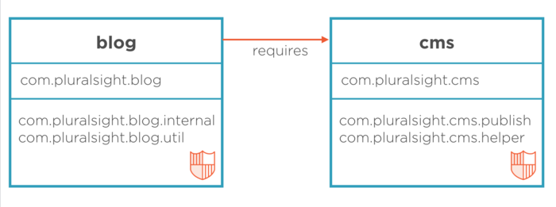

# Java 模块

## 声明模块

每个 `.jar` 文件可以声明为一个模块. 只需要在根 class path 的位置声明 `module-info.java` 文件如下:

```java
module blog {
    exports edu.alvin;  // 从当前模块导出的包名称
    exports ...

    requires cms;       // 当前模块必要的包名称
}
```


