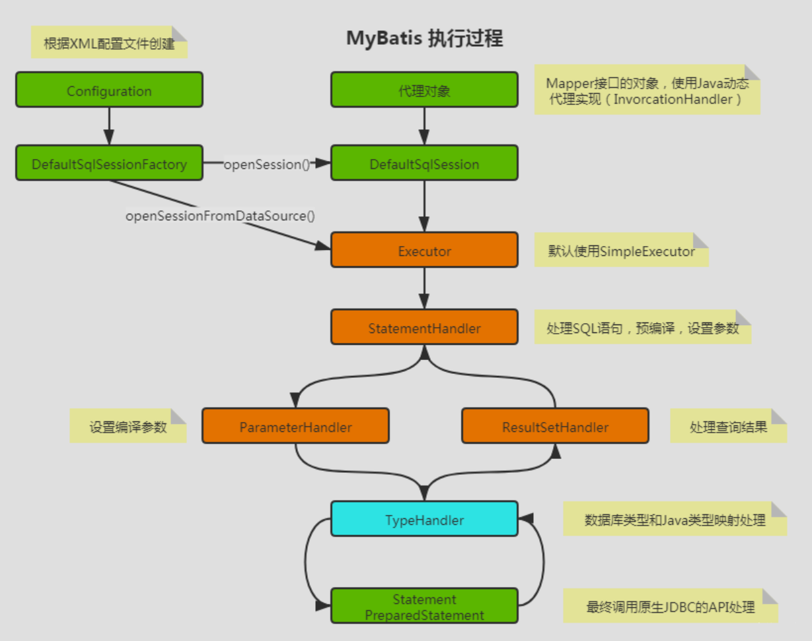
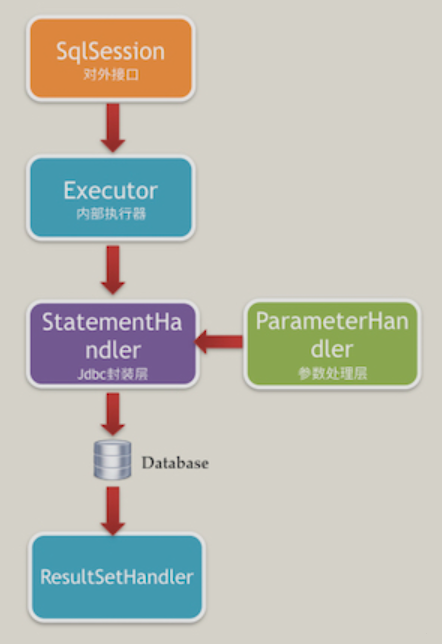

# Mybatis

<!-- @import "[TOC]" {cmd="toc" depthFrom=1 depthTo=6 orderedList=false} -->

<!-- code_chunk_output -->

- [Mybatis](#mybatis)
  - [1. 执行过程](#1-执行过程)
    - [1.1. 核心对象](#11-核心对象)
    - [1.2. 执行过程分析](#12-执行过程分析)
  - [2. Mybatis 拦截器](#2-mybatis-拦截器)
    - [2.1. 自定义拦截器](#21-自定义拦截器)
    - [2.2. 添加注解](#22-添加注解)
      - [2.2.1. `@Signature` 注解](#221-signature-注解)
      - [2.2.2. `@Signature` 注解中的 `type` 属性](#222-signature-注解中的-type-属性)
    - [2.3. 实现 `org.apache.ibatis.plugin.Interceptor` 接口](#23-实现-orgapacheibatisplugininterceptor-接口)
      - [2.3.1. `intercept` 方法](#231-intercept-方法)
      - [2.3.2. `plugin` 方法](#232-plugin-方法)
      - [2.3.3. `setProperties` 方法](#233-setproperties-方法)

<!-- /code_chunk_output -->

## 1. 执行过程

### 1.1. 核心对象

- `Configuration`: 初始化基础配置, 比如 Mybatis 的别名等, 一些重要的类型对象, 如插件, 映射器, `ObjectFactory`
  和 `TypeHandler` 对象, MyBatis 所有的配置信息都维持在 `Configuration` 对象之中
- `SqlSessionFactory`: `SqlSession` 工厂
- `SqlSession`: 作为 Mybatis 工作的主要顶层 API, 表示和数据库交互的会话, 完成必要的数据库增删改查功能
- `Executor`: Mybatis 的内部执行器, 它负责调用 `StatementHandler` 操作数据库, 并把结果集通过 `ResultSetHandler` 进行自动映射.
  另外, 它还处理二级缓存的操作
- `StatementHandler`: Mybatis 直接在数据库执行 SQL 脚本的对象. 另外它也实现了 Mybatis 的一级缓存
- `ParameterHandler`: 负责将用户传递的参数转换成 JDBC `Statement` 所需要的参数. 是 Mybatis 实现 SQL 入参设置的对象
- `ResultSetHandler`: 负责将 JDBC 返回的 `ResultSet` 结果集对象转换成 `List` 类型的集合. 是 Mybatis `把ResultSet`
  集合映射成 `POJO` 的接口对象
- `TypeHandler`: 负责 Java 数据类型和 JDBC 数据类型之间的映射和转换
- `MappedStatement`: `MappedStatement` 维护了一条 `select | update | delete | insert` 节点的封装
- `SqlSource` : 负责根据用户传递的 `parameterObject`, 动态地生成 SQL 语句, 将信息封装到 `BoundSql` 对象中, 并返回
- `BoundSql`: 表示动态生成的 SQL 语句以及相应的参数信息

### 1.2. 执行过程分析



> 问题: 通过 Mybatis 的 `<if>` 标签动态修改 SQL 语句, 为什么不能通过 `ParameterHandler`?
> 答案: 在执行 `ParameterHandler` 之前, `BoundSQL` 对象已经生成了, 即预编译的 SQL 语句已经生成了; 可见, `BoundSql` 生成
> SQL 语句的时机在于 `StatementHandler` 的创建, 由 `MappedStatementHandler.getBoundSql(Object parameterObject)`
> 函数解析动态标签,
> 生成静态 SQL 语句, 早于 `ParameterHandler` 和 `ResultSetHandler` 的时机；因此, 只能通过影响 `parameterObject` (
> 暂时先将其看成一个 `Map`, 键值分别为参数名和参数值) 的值, 来干预对 `mapper.xml` 标签的解析过程,
> 从而改变生成的 `BoundSql` 对象

## 2. Mybatis 拦截器

### 2.1. 自定义拦截器

- 定义一个实现 `org.apache.ibatis.plugin.Interceptor` 接口的拦截器类, 并实现其中的方法
- 添加 `@Intercepts` 注解, 写上需要拦截的对象和方法, 以及方法参数
- 在 Mybatis 的全局配置 `XML` 中配置插件 `plugin`; 对于去 `XML` 的 Spring 工程, 显示的注册这个拦截器 Bean 即可

### 2.2. 添加注解

Mybatis 拦截器默认可以拦截的类型只有 4 种, 即 4 种接口类型 `Executor`, `StatementHandler`, `ParameterHandler`
和 `ResultSetHandler`. 对于自定义拦截器必须使用 Mybatis 提供的 `@Intercepts` 注解来指明要拦截的是 `4` 种类型中的哪一种接口

#### 2.2.1. `@Signature` 注解

```java
@Intercepts // 描述: 标志该类是一个拦截器
@Signature  // 描述: 指明该拦截器需要拦截哪一个接口的哪一个方法
```

#### 2.2.2. `@Signature` 注解中的 `type` 属性

```java
type;   // 四种类型接口中的某一个接口, 如 Executor.class
method; // 对应接口中的某一个方法名, 比如 Executor 的 query 方法
args;   // 对应接口中的某一个方法的参数, 比如 Executor 中 query 方法因为重载原因有多个, args 就是指明参数类型, 从而确定是具体哪一个方法
```

Mybatis 拦截器默认会按顺序拦截以下的 4 个接口中的所有方法:

```java
org.apache.ibatis.executor.Executor;                    // 拦截执行器方法
org.apache.ibatis.executor.statement.StatementHandler;  // 拦截 SQL 语法构建处理
org.apache.ibatis.executor.parameter.ParameterHandler;  // 拦截参数处理
org.apache.ibatis.executor.resultset.ResultSetHandler;  // 拦截结果集处理
```

这几个接口之间的关系大概是这样的:



### 2.3. 实现 `org.apache.ibatis.plugin.Interceptor` 接口

实现 `Interceptor` 接口, 主要是实现下面几个方法:

- `intercept(Invocation invocation)` 方法
- `plugin(Object target)` 方法
- `setProperties(Properties properties)` 方法

#### 2.3.1. `intercept` 方法

进行拦截的时候要执行的方法. 该方法参数 `Invocation` 类中有三个字段:

```java
private final Object target;
private final Method method;
private final Object[] args;
```

可通过这三个字段分别获取下面的信息：

```java
Object target = invocation.getTarget(); // 被代理对象
Method method = invocation.getMethod(); // 代理方法
Object[] args = invocation.getArgs();   // 方法参数
```

方法实现的结尾处, 一般要真正调用被代理类的方法, 即:

```java
return invocation.proceed();
```

#### 2.3.2. `plugin` 方法

插件用于封装目标对象的, 通过该方法我们可以返回目标对象本身, 也可以返回一个它的代理, 可以决定是否要进行拦截进而决定要返回一个什么样的目标对象,
官方提供了示例:

```java
return Plugin.wrap(target, this);
```

> 可以在这个方法中提前进行拦截对象类型判断从而提高性能, 如我们仅对 `Executor` 拦截, 可以这么写:
>
> ```java
> @Override
> public Object plugin(Object target) {
>   // 只对要拦截制定类型的对象生成代理
>   if(target instanceof Executor) {
>       return Plugin.wrap(target, this);
>   }
>   return target;
> }
> ```

Mybatis 拦截器用到 **责任链模式 + 动态代理 + 反射机制**; 所有可能被拦截的处理类都会生成一个 **代理类**, 即如果有 N 个拦截器,
就会有 N 个代理, 层层生成动态代理是比较耗性能的, 而且虽然能指定插件拦截的位置, 但这个是在执行方法时利用反射动态判断的,
初始化的时候就是简单的把拦截器插入到了所有可以拦截的地方

尽量不要编写不必要的拦截器, 另外我们可以在调用插件的地方添加判断, 只要是当前拦截器拦截的对象才进行调用, 否则直接返回目标对象本身,
这样可以减少反射判断的次数, 提高性能

#### 2.3.3. `setProperties` 方法

如果我们拦截器需要用到一些变量参数, 而且这个参数是支持可配置的, 类似 Spring 中的 `@Value("${}")` 从 `application.yml`
文件获取自定义变量属性, 这个时候我们就可以使用这个方法

参考下方代码, 在 Mybatis 配置文件中配置插件时可以设置参数, 在 `setProperties`
函数中调用 `Properties.getProperty("param1")` 方法可以得到配置的值:

```xml
<plugins>
  <plugin interceptor="com.xx.xx.xxxInterceptor">
    <property name="param1" value="value1" />
  </plugin>
</plugins>
```

实际上是解析 XML, 将 XML 中注册的拦截器的配置带过来
